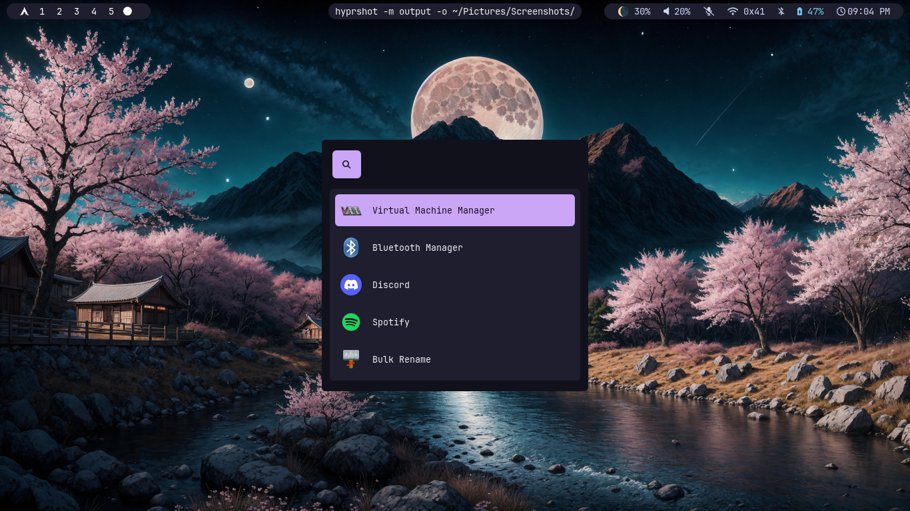

# 🛠️ My Personal Dotfiles

A comprehensive collection of my personal configuration files for Arch Linux, including shell, editor, hyprland window manager, terminal, and other environment setups.

This repository is designed to be **modular**, **easy to clone**, and **simple to apply** on any fresh system.

---

## 📸 Screenshots




---

## 🚀 Features

* Fully customizable and modular dotfiles
* Works on Arch Linux with Hyprland WM 
* Includes terminal configs, shell aliases, scripts, themes, etc.
* Git-friendly structure

---

## 📥 Installation

### **1. Clone the repository**

```bash
git clone https://github.com/subinlearns/dotfiles.git ~/.dotfiles
```

---

## 📦 Apply Dotfiles

```bash
cd ~/.dotfiles
```

```bash
cp -r ~/.dotfiles/* ~/
````

---

## 🧩 Structure

```
.dotfiles/
├── .zshrc
└── .config/
```

```

---

## 💬 Notes
- Be sure to back up your existing configs before applying
- Works best when paired with a package list for automated setup
- You can fork this repo to create your own setup

---

## 📄 License
MIT License
Feel free to use and customize.

---

